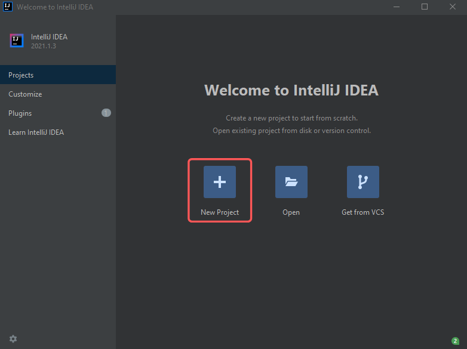
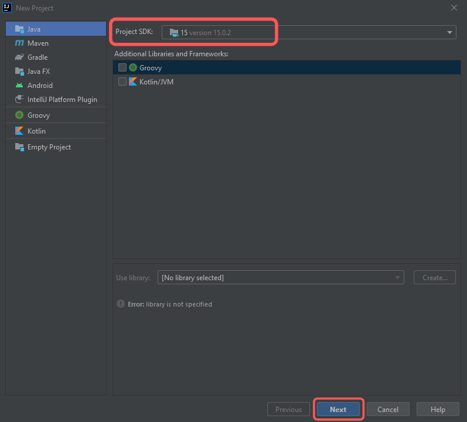
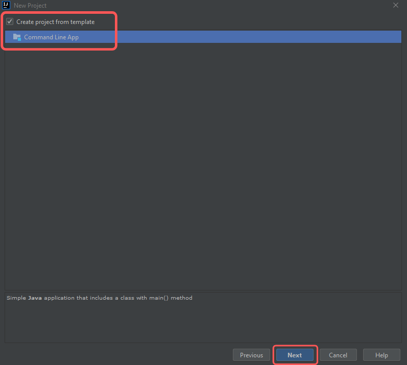
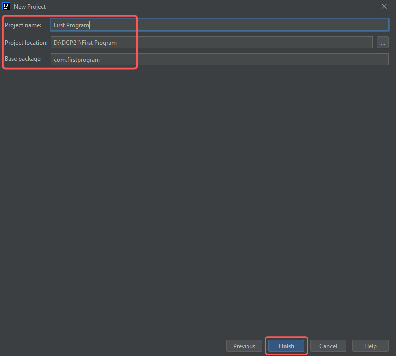
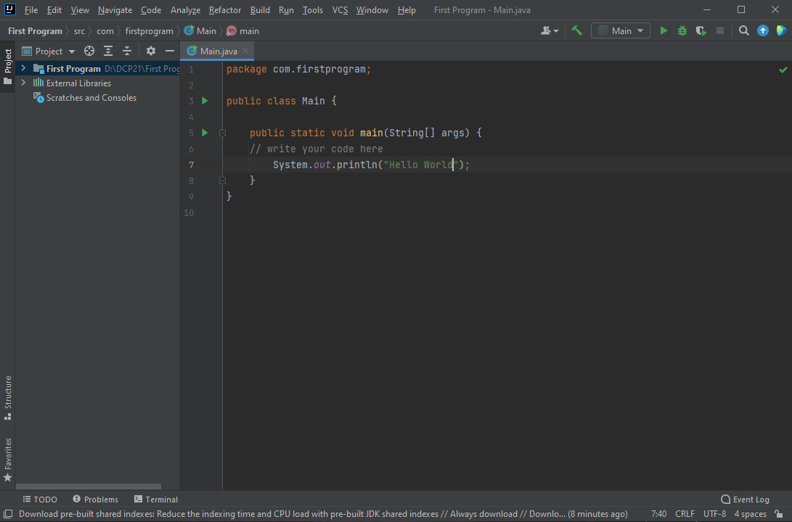
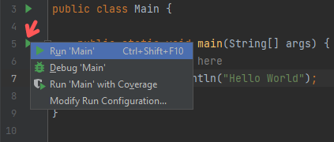
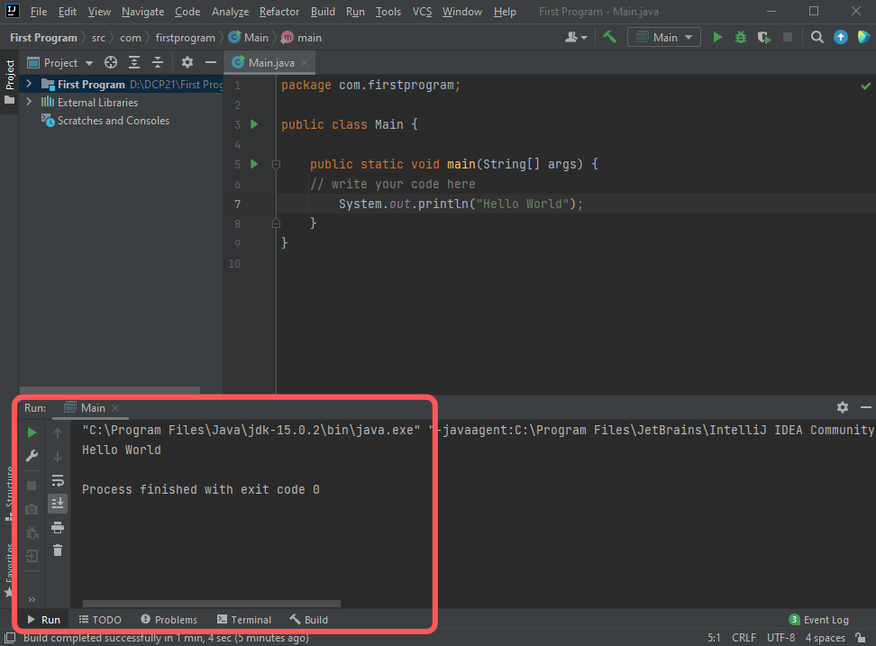

# Java Program through IDE

Hey Learners, In this topic we can learn about IDE's and how can we use it with example.


## IDE

- An IDE or Integrated Development Environment is a software application that provides multiple features to enhance programming activity.

- It makes coding easier and increase productivity for developers.

- It contains features like syntax highlighting, code completion, debugger, version control, etc.

### Popular Java IDE's

- [IntelliJ IDEA](https://www.jetbrains.com/idea/)
- [Eclipse](https://www.eclipse.org/eclipseide/)
- [Xcode](https://developer.apple.com/xcode/)
- [NetBeans](https://netbeans.apache.org/)


## Setup & Run

For understanding, We can see an example of creating a Hello World program in an IDE.

> Note: Major IDE's have same style setup while creating a project.

I'm taking IntelliJ IDEA. You can download it from [above](#Popular%20Java%20IDE's).

And I'm assuming that you are installed JDK already. If you've not done before checkout [here](https://www.wikihow.com/Install-the-Java-Software-Development-Kit).

### Steps

Let's START,

1) Open IntelliJ IDEA and Click on New Project.
    

2) Select your SDK and Click Next. I have SDK 15, it is choosen by default.
    

3) Click & check Create project from template.(Optional)
    

4) Fill your Project name, location and Base package. And click Finish.
    

5) If you've done Step 3 you'll see a template of code in editor. So you just need to type below code after //write your code here.
    
    ```java
    System.out.println("Hello World");
    ```
    
    If you can't see that simply copy paste the below code which is a Hello World program in Java.
    ```java
    public class Main {

        public static void main(String[] args) {
            // Below statement prints "Hello World"
            System.out.println("Hello World");
        }
    }
    ```
    

6) Click on the Play button, located left side of the main() method in Main class. And click Run.
    

### Output

- Unlike on command-line, you don't need any steps involving compiling and running java files in IDE's.

- You have to just click Run, the IDE will compile and run the file for you. 

- After clicking Run you'll see output like this,
    

That's all about Java program through IDE.

> I added a file HelloWorld.java for example. You can use it either in IDE or command-line.

## Author
[NanthaKumar](https://github.com/nknantha)