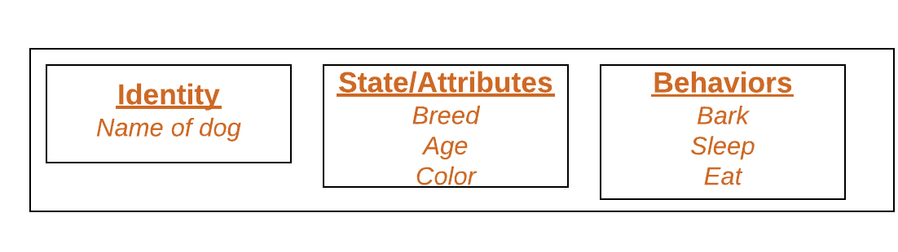
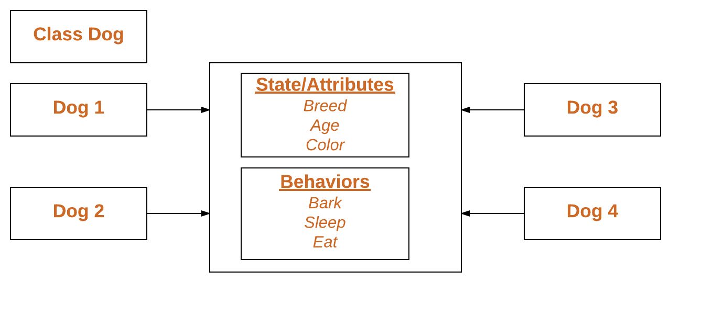

# Classes and Objects in Java

Classes and Objects are basic concepts of Object Oriented Programming which revolve around the real life entities.
## Class
A class is a user defined blueprint or prototype from which objects are created.  It represents the set of properties or methods that are common to all objects of one type. In general, class declarations can include these components, in order: 
1.	_Modifiers:_ A class can be public or has default access (Refer this for details).
2.	_class keyword:_ class keyword is used to create a class.
3.	_Class name:_ The name should begin with an initial letter (capitalized by convention).
4.	_Superclass(if any):_ The name of the class’s parent (superclass), if any, preceded by the keyword extends. A class can only extend (subclass) one parent.
5.	_Interfaces(if any):_ A comma-separated list of interfaces implemented by the class, if any, preceded by the keyword implements. A class can implement more than one interface.
6.	_Body:_ The class body surrounded by braces, { }.
Constructors are used for initializing new objects. Fields are variables that provides the state of the class and its objects, and methods are used to implement the behavior of the class and its objects.
There are various types of classes that are used in real time applications such as nested classes, anonymous classes, lambda expressions. 
## Object
It is a basic unit of Object-Oriented Programming and represents the real life entities.  A typical Java program creates many objects, which as you know, interact by invoking methods. An object consists of : 
1.	*State:* It is represented by attributes of an object. It also reflects the properties of an object.
2.	*Behavior:* It is represented by methods of an object. It also reflects the response of an object with other objects.
3.	*Identity:* It gives a unique name to an object and enables one object to interact with other objects.
Declaring Objects (Also called instantiating a class)
When an object of a class is created, the class is said to be instantiated. All the instances share the attributes and the behavior of the class. But the values of those attributes, i.e. the state are unique for each object. A single class may have any number of instances.

### Example:

Objects correspond to things found in the real world. For example, a graphics program may have objects such as “circle”, “square”, “menu”. An online shopping system might have objects such as “shopping cart”, “customer”, and “product”. 
 

Declaring Objects (Also called instantiating a class)
When an object of a class is created, the class is said to be instantiated. All the instances share the attributes and the behavior of the class. But the values of those attributes, i.e. the state are unique for each object. A single class may have any number of instances.

### Example: 

As we declare variables like (type name;). This notifies the compiler that we will use name to refer to data whose type is type. With a primitive variable, this declaration also reserves the proper amount of memory for the variable. So for reference variable, type must be strictly a concrete class name. In general, we can’t create objects of an abstract class or an interface.  

Dog tuffy;
If we declare reference variable(tuffy) like this, its value will be undetermined(null) until an object is actually created and assigned to it. Simply declaring a reference variable does not create an object.