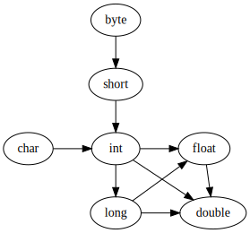

# Compile-time Polymorphism


## Polymorphism
Polymorphism is the ability to take many forms instead of one. It describes the
concept that different classes can be used with same interface. It occurs when
multiple classes related each other by inheritance.
There are 2 types of polymorphism,
- Compile-time Polymorphism.
- Run-time Polymorphism.


## Compile-time Polymorphism
An object's functionality resolved at compile time rather than run-time is known
as Compile-time Polymorphism. Compile-time polymorphism is achieved through method
overloading. It provides fast execution because the method that needs to be
executed is known early at the compile time. It is also known as static polymorphism,
early binding and overloading.


## Method Overloading
In a namespace, more than one method having same name and different datatype of parameters
or different number of parameters is known as Method overloading. On execution particular
method signature chosen by given arguments. If matching method signature not found then 
the argument datatype promoted to another data type. Method overloading provides greater
readability and productivity. It is related to compile-time polymorphism.

### Type Promotion 
Type promotion happens in this way,  



## Example
```java
// Public main class CompiletimePolymorphism.
public class CompiletimePolymorphism {

    // Signature - 1:
    // sum() method with 2 integer parameter.
    static int sum(int a, int b) {
        return a + b;
    }

    // Signature - 2:
    // sum() method with 2 float parameter.
    static float sum(float a, float b) {
        return a + b;
    }

    // Signature - 3:
    // sum() method with 3 integer parameter.
    static int sum(int a, int b, int c) {
        return a + b + c;
    }
    
    // main() method contains driver code and demonstration.
    public static void main(String[] args) {
        
        // Calling sum() method with 2 integer values and 
        // printing the result.
        System.out.println(sum(3, 10));

        // Calling sum() method with 2 float values and 
        // printing the result.
        System.out.println(sum(3.0f, 10.0f));

        // Calling sum() method with 3 integer values and 
        // printing the result.
        System.out.println(sum(3, 10, 2));

        // Above different method calls of sum() are resolved at compiletime
        // rather than runtime.
    }
}
```
> *You can find the above on [CompiletimePolymorphism.java](CompiletimePolymorphism.java).*


## Output
```
13
13.0
15
```


## Author
[NanthaKumar](https://github.com/nknantha "NanthaKumar's Profile")
